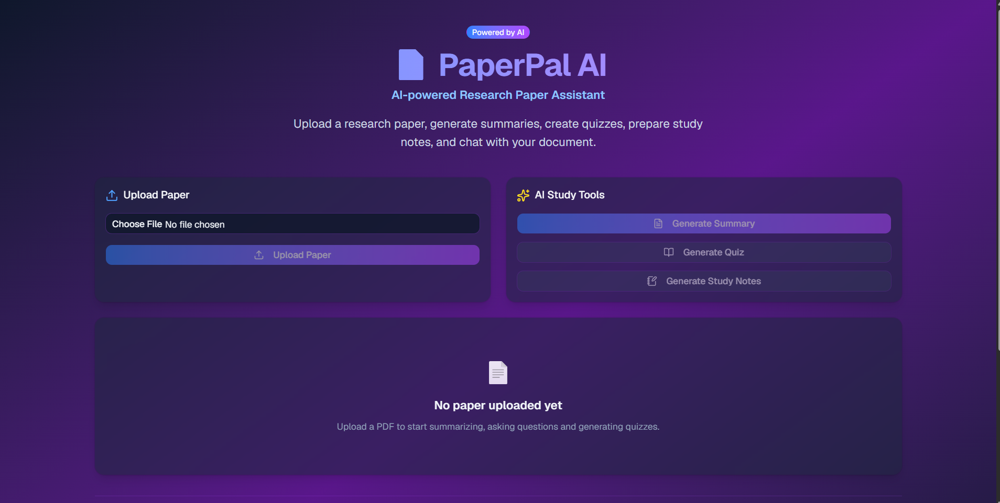
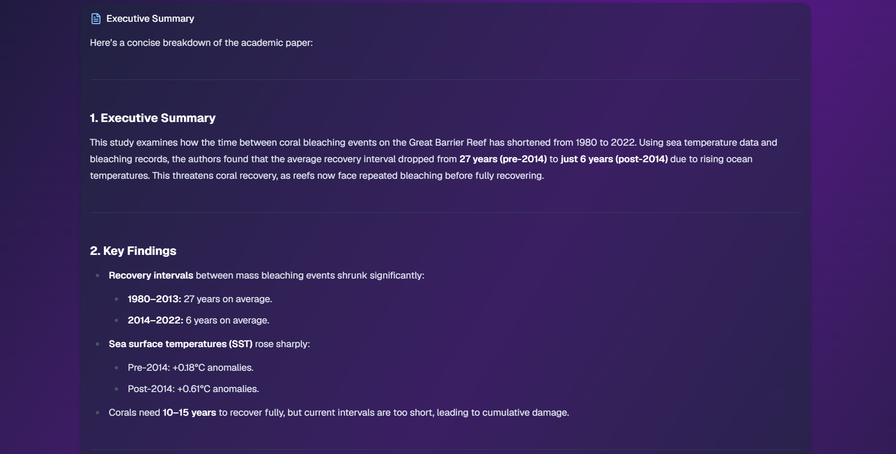
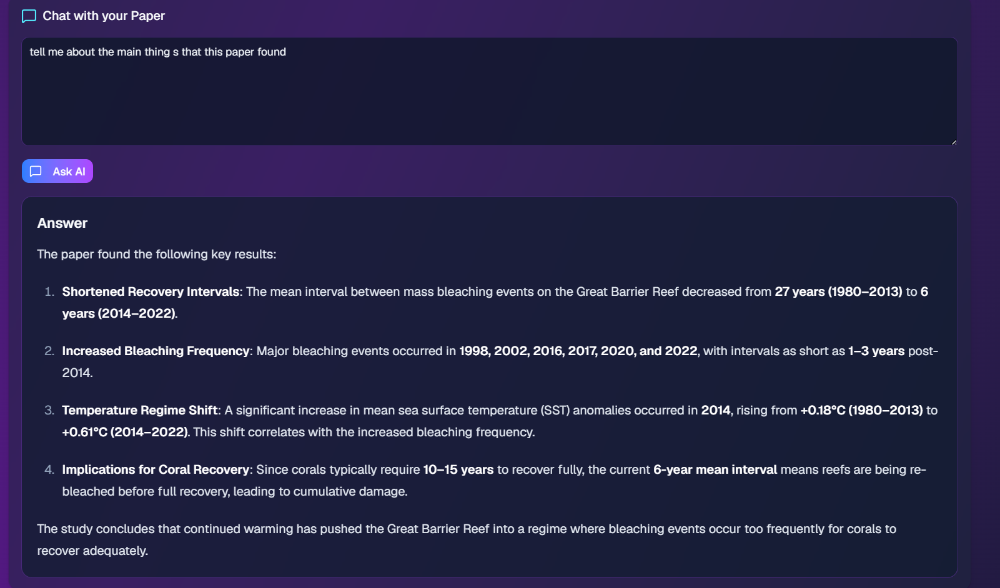
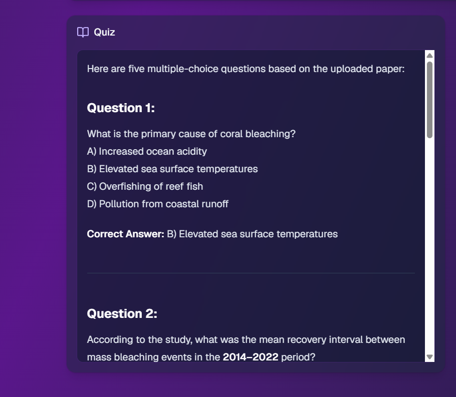
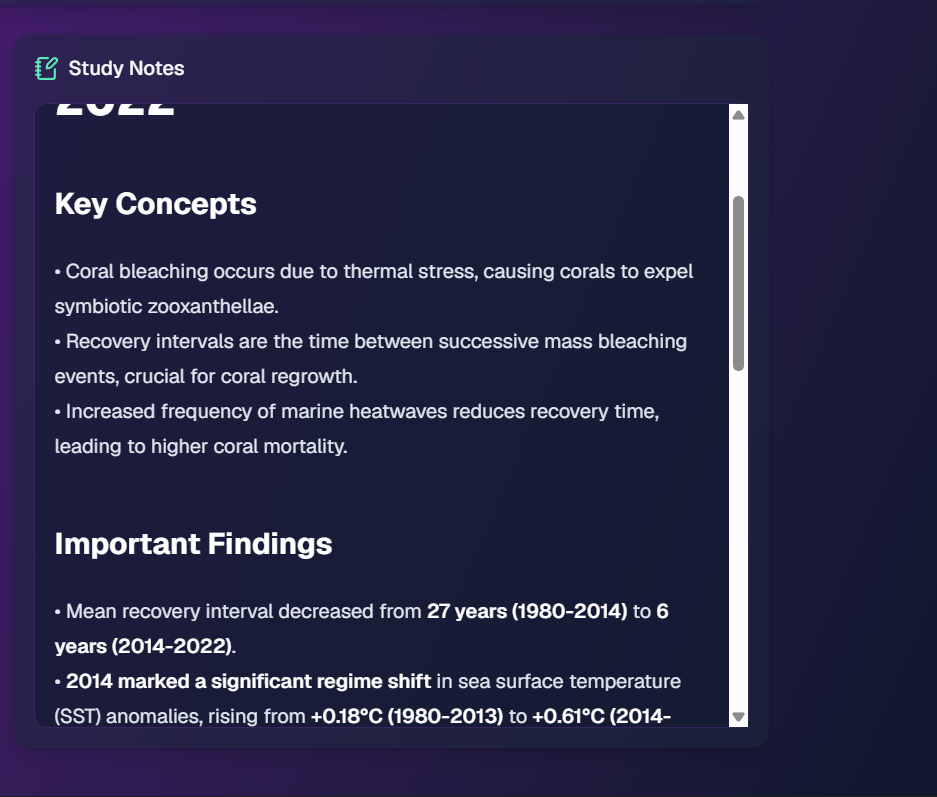

# 📄 PaperPal AI

<div align="center">

### 🚀 AI-Powered Research Paper Assistant

**Upload a research paper and instantly generate AI summaries, study notes, quizzes, and context-aware answers from a single PDF.**

<br>


</div>

---

# 🌟 Overview

Reading academic research papers is often time-consuming and overwhelming.

**PaperPal AI** transforms lengthy research papers into concise, interactive learning material using Large Language Models.

Simply upload a research paper in PDF format and instantly:

* 📄 Generate structured AI summaries
* 💬 Ask questions about the paper
* 📝 Create revision-friendly study notes
* ❓ Generate multiple-choice quizzes

PaperPal AI combines a modern React frontend with a FastAPI backend to provide a clean and intuitive research assistant.

## 🌐 Live Demo

**Live Application:** https://paper-pal-ai-psi.vercel.app

**Backend API:** https://paperpal-ai-1.onrender.com

---

# ✨ Features

| Feature           | Description                                                        |
| ----------------- | ------------------------------------------------------------------ |
| 📤 PDF Upload     | Upload research papers in PDF format                               |
| 📄 AI Summary     | Executive summary, key findings, methodology & limitations         |
| 💬 Ask AI         | Ask questions and receive answers based only on the uploaded paper |
| 📝 Study Notes    | Automatically generate structured revision notes                   |
| ❓ Quiz Generator  | Create multiple-choice questions for self-assessment               |
| ⚡ Fast Processing | PDF parsing using PyMuPDF                                          |
| 🎨 Modern UI      | Responsive interface built with Tailwind CSS & shadcn/ui           |
| 🛡 Error Handling | Robust frontend and backend validation                             |

---

# 🖼 Preview

## Home



---

## AI Summary



---

## Ask AI



---

## Quiz Generator



---

## Study Notes



---

# 🏗 Architecture

```text
                 ┌─────────────────────┐
                 │     React Frontend  │
                 │  TypeScript + Vite  │
                 └──────────┬──────────┘
                            │
                       Axios Requests
                            │
                 ┌──────────▼──────────┐
                 │    FastAPI Backend  │
                 │      Python API     │
                 └──────────┬──────────┘
                            │
                    PDF Text Extraction
                      (PyMuPDF / fitz)
                            │
                 ┌──────────▼──────────┐
                 │    OpenRouter API   │
                 │  Large Language AI  │
                 └──────────┬──────────┘
                            │
      ┌──────────────┬───────────────┬──────────────┐
      │              │               │              │
   Summary        Q&A Chat        Quiz        Study Notes
```

---

# 🛠 Tech Stack

## Frontend

* React
* TypeScript
* Vite
* Tailwind CSS
* shadcn/ui
* Axios

---

## Backend

* FastAPI
* Python
* PyMuPDF (fitz)
* OpenRouter API
* OpenAI SDK
* Uvicorn

---

# 📂 Project Structure

```text
PaperPal-AI
│
├── backend
│   ├── app
│   │   ├── main.py
│   │   └── ai_service.py
│   │
│   ├── uploads
│   ├── requirements.txt
│   └── .env
│
├── frontend
│   ├── src
│   │   ├── components
│   │   ├── hooks
│   │   ├── services
│   │   ├── utils
│   │   ├── App.tsx
│   │   └── main.tsx
│   │
│   ├── package.json
│   └── .env
│
├── assets
│
└── README.md
```

---

# 🚀 Getting Started

## Clone the Repository

```bash
git clone https://github.com/Hemang71/PaperPal-AI.git

cd PaperPal-AI
```

---

# ⚙ Backend Setup

```bash
cd backend

python -m venv venv

venv\Scripts\activate

pip install -r requirements.txt
```

Create a `.env` file

```env
OPENROUTER_API_KEY=YOUR_API_KEY
```

Run the backend

```bash
uvicorn app.main:app --reload
```

Backend runs at

```
http://127.0.0.1:8000
```

---

# 💻 Frontend Setup

```bash
cd frontend

npm install

npm run dev
```

Create a `.env` file

```env
VITE_API_URL=http://127.0.0.1:8000
```

Frontend runs at

```
http://localhost:5173
```

---

# 🎯 AI Capabilities

✔ Research Paper Summarization

✔ Context-Aware Question Answering

✔ Study Notes Generation

✔ Quiz Generation

✔ PDF Text Extraction

✔ Prompt Engineering

✔ AI-powered Learning Assistant

---

# 📊 Project Highlights

* Full Stack AI Application
* Responsive Modern UI
* Component-Based Architecture
* Modular Backend Design
* REST API with FastAPI
* Environment-Based Configuration
* Error Handling & Validation
* Clean Code Structure
* Ready for Deployment

---

# 🚧 Future Improvements

* User Authentication
* Chat History
* PDF Highlighting
* OCR Support
* Export Summary as PDF
* Multi-language Support
* Semantic Search
* Cloud Storage Integration

---

# 👨‍💻 Author

### Hemang Bhatt

B.Tech Computer Science Engineering

GitHub

https://github.com/Hemang71

---

# ⭐ If you like this project...

Give it a ⭐ on GitHub!

It helps others discover the project and supports future development.

---

<div align="center">

### Built with ❤️ using React, FastAPI & Large Language Models

</div>
